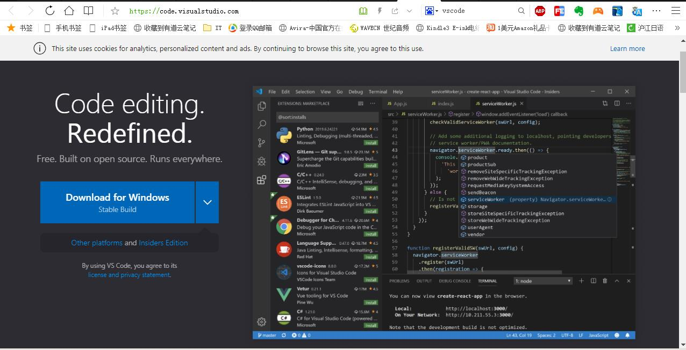
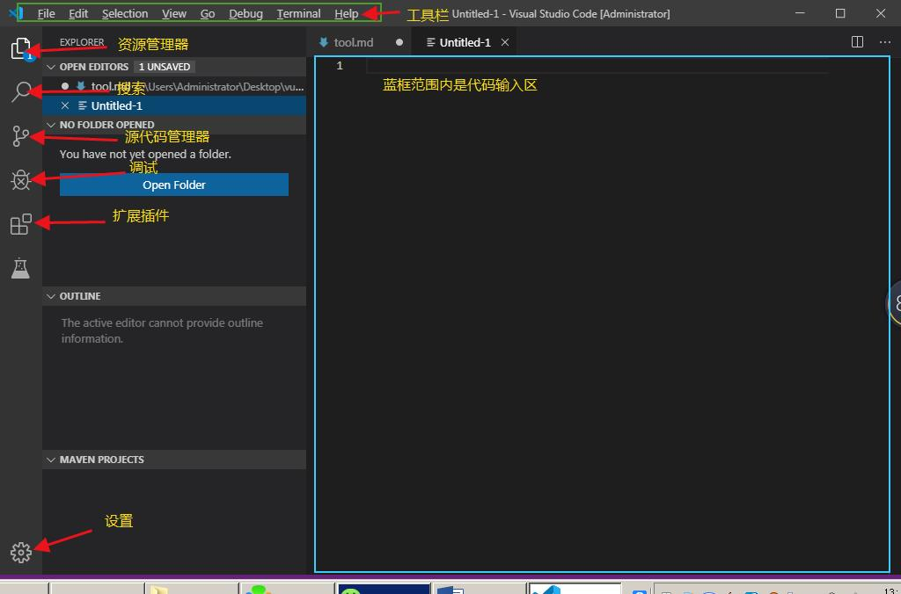

# 基础工具软件
## Visual Studio Code

> VS Code是微软推出的新一代**免费开源**的现代化**轻量级**代码编辑器，支持几乎所有主流的开发语言的语法高亮、智能代码补全、自定义快捷键、括号匹配和颜色区分、代码片段、代码对比 Diff、GIT命令 等特性，支持**插件扩展**，并针对网页开发和云端应用开发做了优化。软件跨平台支持 Win、Mac 以及 Linux，运行流畅，可谓是微软的良心之作

官方网站 https://code.visualstudio.com/

### VS Code功能简单介绍

#### 常用快捷键
Ctrl + Shift + E  资源管理器     
Ctrl + Shift + F  搜索       
Ctrl + Shift + G  源代码管理器    
Ctrl + Shift + D  调试        
Ctrl + Shift + X  插件扩展        
F1 或 Ctrl+ Shift + p 打开命令面板
Shift + Alt + F  代码格式化
Ctrl+ F 查找
Ctrl+ H 查找替换
Ctrl+ N 新建文件
Ctrl+ S 保存
Alt + ↑ 或 Alt + ↓    上下移动一行 
Shift + Alt + ↑ 或 Shift + Alt + ↓ 向上向下复制一行
F11 全屏

**git常用命令**
> * 配置git用户名和密码
>     * git config  --global user.name sun
>     * git config  --global user.email  sun@qq.com
> * 查看当前git的配置
>     * git config --list
> * 初始化git 仓库
>     *  git init
> * 查看当前仓库的状态
>     * git status
> * 将工作目录中的文件添加到暂存区
>     * git add sun.html（这个命令上传一个文件）     git add  .(这个命令会将当前目标下所有文件上传)    git   add  a.txt  b.txt (如果上传多个，文件名之间用空格)
> *  将暂存区中的代码提交到本地仓库，形成一个版本
>     *  git  commit -m "备 注"（如果备注内容带空格，则需要加“”）
> * 查看本地仓库中的历史提交版本
>     * git  log
> * 用暂存区中的文件覆盖工作目录中的文件
>     * git  checkout -- 文件名
> * 回滚到本地仓库中特定版本并覆盖暂存区和工作目录
>     * git  reset --hard  commitID(commitID可以到git log中查看提交编号)，有种方式：1、全部黏贴  2、只取前6位